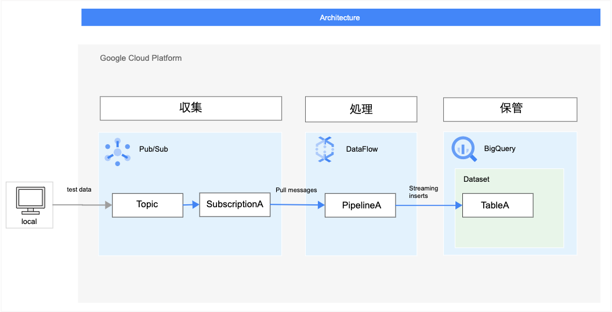
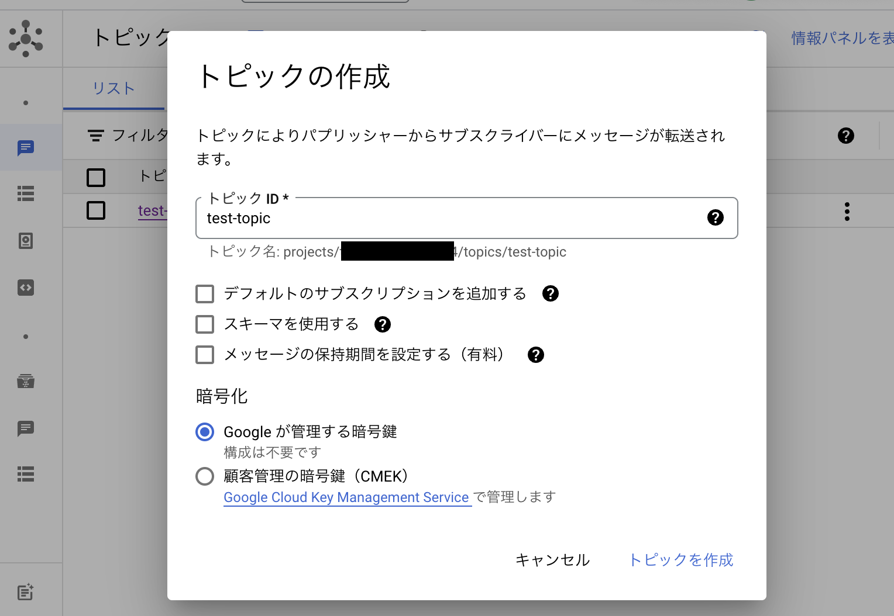
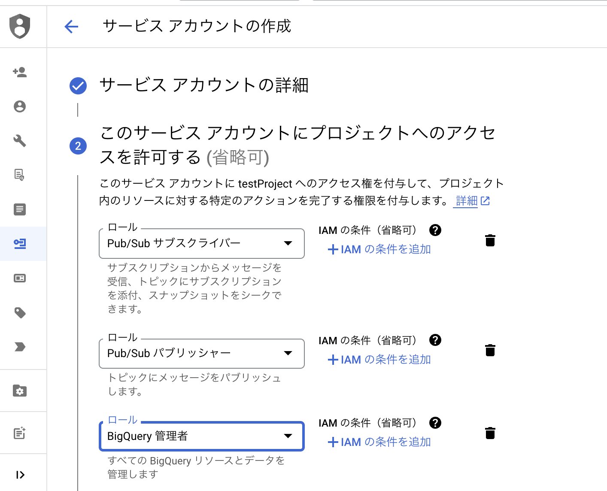
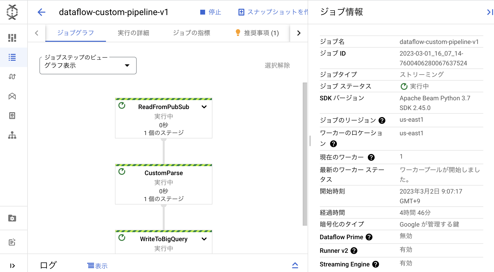
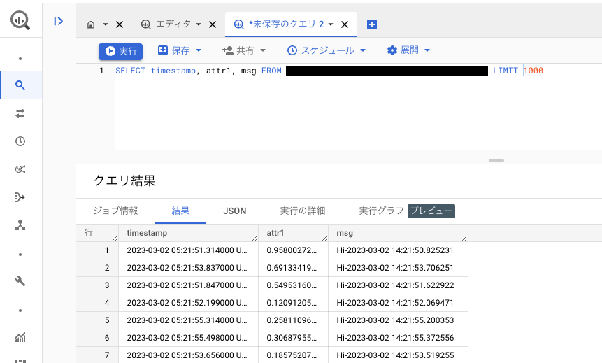

# GCPとApache Beamを利用したパイプライン　プロジェクト

## 概要
リアルタイムデータの収集・処理・保管を目的として下記の流れをGCPで構築してきます。
Pub/Subからリアルタイムにデータを取得 → Dataflowでデータ処理 → 結果をBigQueryに書き出す

以下は、今回のアーキテクチャです。



## ステップ
### ステップ1：プロジェクトの準備
1. Google Cloud プロジェクトを作成する
   * GCPで作業をするための最初のステップです。詳細は省略します。
2. Pub/Subトピックとサブスクリプションを作成する
   
   * Pub/Subはメッセージが承認されるまで保存されるトピックを必要とするためGCP上でトピックを作成します。
   * DataFlowが使用するpullサブスクリプションが必要になるためサブスクリプションも作成します。
3. BigQuery のデータセットとテーブルの作成
   * BigQueryではまずデータセットを作成します。
   

   * 次に下記のスキーマのテーブルを作成します。
   * `timestamp:TIMESTAMP,attr1:FLOAT,msg:STRING`
   * クエリがより効率的になるように取り込み時間でパーティションを設定しておきます。
4. クラウドストレージのバケットを作成する
   * クラウドストレージはDataflow パイプラインによって一時ストレージの場所として利用されるためGCP上でバケットを作成します。
   * クラスはStandardでジョブと同じリージョンに作成します。

5. サービスアカウントの作成
   * パイプラインのデプロイ、テスト用に必要最低限の下記の権限を追加していきます。
      * Pub/Sub サブスクライバー
      * BigQuery データ編集者
      * Cloud Storage ストレージ管理者
      * Service Accounts サービスアカウントユーザー
      * Dataflow 管理者
      * Pub/Sub パブリッシャー
   

6. その後サービスアカウントのJsonキーをダウンロードしておきます。

### ステップ2 - パイプラインのコード作成
Pythonでapache-beam sdkを利用するため事前にインストール。
``` 
pip install apache-beam[gcp] 
``` 
以下は、Pythonパイプラインのコードです。
* [pipeline_with_apache_beam_transform.py](codes/pipeline_with_apache_beam_transform.py)

パイプラインは３つのステップで構成しています。
   * ReadFromPubSub：Pub/Subからデータを読み込み
   * CustomParse：データに対して行いたい処理を行う
   * WriteToBigQuery：CustomParseで処理されたデータをBiqQueryに書き込む

### ステップ3 - パイプラインをローカルで実行
パイプラインのコードの準備ができたので下記のコマンドでローカルで実行してみます。
``` 
python pipeline_with_apache_beam_transform.py 
--streaming
```
もし実行に失敗する場合は下記を確認してみます。
* サービスアカウントで正しく権限設定されているか
* Dataflow APIが有効になっているか

### ステップ4 - テストする
あとはPub/Subメッセージを公開すれば実際に確認ができるために下記のpythonコードを実行し連続したメッセージを送信しパイプラインが取得、処理するようにします。
* [pubsub_emulator.py](codes/pubsub_emulator.py)

もし実行に失敗する場合は下記を確認してみます。
* サービスアカウントで正しく権限設定されているか
* Cloud Pub/Sub APIが有効になっているか

### ステップ5 - GCPにデプロイし確認
テストが終わったら下記のコマンドで実際にGCP上にデプロイします。
``` 
python pipeline_with_apache_beam_transform.py 
--streaming
--runner DataflowRunner 
--project PROJECT_ID 
--region us-east1 
--temp_location gs://dataflow-test-99999/ 
--job_name dataflow-pipeline-v1 
--max_num_workers 2
``` 

セットアップに少し時間がかかりますが成功している場合下記のようにGCP上にジョブが表示されます。


再度Pub/Subのテストを実行しBiqQueryにて下記のSQLを実行するとデータが格納されていることを確認できます。
``` SQL
SELECT timestamp, attr1, msg FROM `{PROJECT_ID}.{DATASET_NAME}.{TABLE_NAME}` LIMIT 1000
``` 
